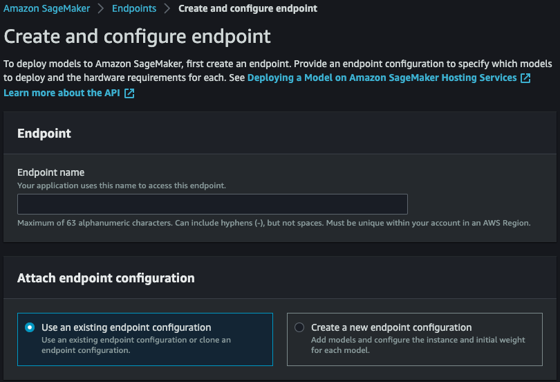
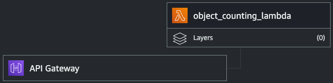
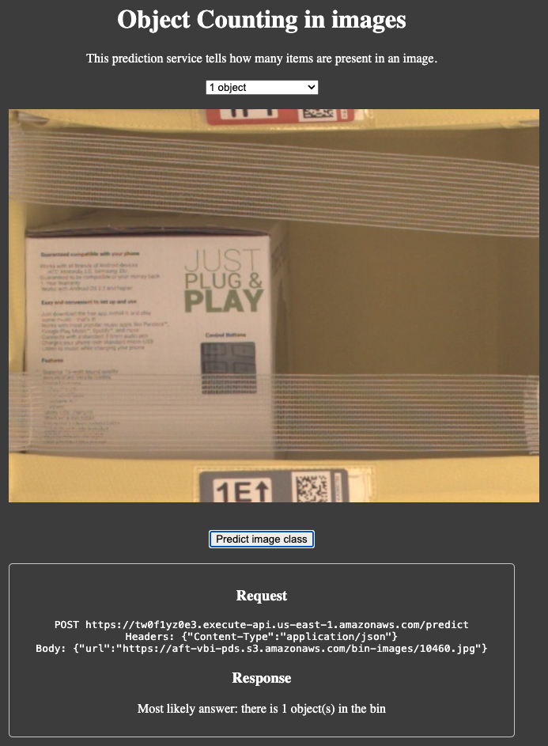

## Deployment
After training is accomplished, the model output is uploaded to S3. Having access to the `model.tar.gz` artifact makes possible to deploy a private endpoint on AWS Sagemaker.

The code for deployment can be checked in the [sagemaker.ipynb](../sagemaker.ipynb) notebook. Alternatively, if successful endpoint deployments have already happened, go to the AWS web console (Sagemaker, Endpoints section) and create a new endpoint based on the configuration of previous deployments:



## Inference
Once there is a live endpoint already deployed, inference can be done with a Lamba function invokation. For this, get familiar with the [`lamda_fn.py`](lamda_fn.py) Python script and create a new function on AWS. Note that the input of the function is a request which must have a URL of an image. The output of the function is the prediction of the most likely image class.

Note that the [`inference.py`](./inference.py) script plays a key role when performing predictions. Check out how inputs and outputs are processed so that predictions can be returned from the trained model.

It's also important to:
* Provide permissions to access Sagemaker
* Update the script code with the corresponding endpoint name and deploy it
* Test the lambda function passing different urls using the following JSON schema (output from API Gateway):

```
{
  "body": "{\n  \"url\": \"https://aft-vbi-pds.s3.amazonaws.com/bin-images/10460.jpg\"\n}"
}
```

A successful response looks like:

```
{
  "statusCode": 200,
  "headers": {
    "Content-Type": "text/plain",
    "Access-Control-Allow-Origin": "*"
  },
  "body": "Most likely answer: there is 1 object(s) in the bin"
}
```

## Public invokations
API Gateway allows the creation of APIs to back-end systems running on AWS Lambda. Therefore, it fits our purpose to serve predictions requests coming from public users. 



Here is some steps to create a basic API on this AWS service:
* Choose to build a "HTTP API".
* Give your API a name, e.g., `object-counting-api`.
* Skip the routes creation for now.
* Stages, use the `$default` one with auto-deploy enabled.

Now that the API was successfully created, a route can be created to invoke a lambda function:
* Go to Routes and click on Create.
* For fullfilling our project purpose, select POST and route to `/predict`.
* Create and attach an integration, selecting Lambda function as type.
* Select the corresponding function that will take care of making image predictions.

Finally, test the newly created endpoint with a few POST requests:

```
curl -d '{"url": "https://aft-vbi-pds.s3.amazonaws.com/bin-images/10460.jpg"}' -H "Content-Type: application/json" -X POST https://your_api_id.execute-api.us-east-1.amazonaws.com/predict
```

## Public web app
Check the [index.html](https://github.com/saranguiz/ml-sagemaker-pipeline/blob/main/deployment/ui/index.html) page implementation (JavaScript) for more details about how this simple web app queries our public endpoint.

* Go to: [https://sebastian.aranguiz.de/ml/predict](https://sebastian.aranguiz.de/ml/predict) 
* From the dropdown menu, select any image with 1 to 5 objects
* Submit the image and wait for the class prediction


